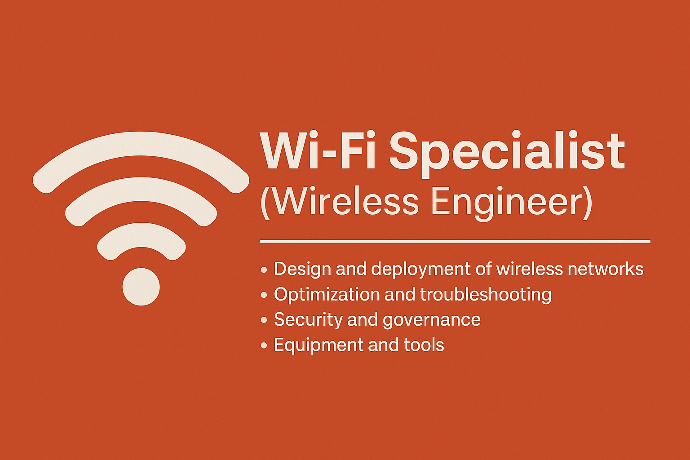

# “Wi-Fi Ninja” 🥷📶

# 📶 Le métier de Spécialiste Wi-Fi (Wireless Engineer)

Bienvenue sur ce repository dédié au métier de **Spécialiste Wi-Fi** !  
Ce README a pour but d’expliquer en détail ce métier passionnant, ses missions, compétences clés, outils, certifications, et comment se lancer.

---

## 🏢 Qui est le Spécialiste Wi-Fi ?

Le Spécialiste Wi-Fi, aussi appelé **Wireless Engineer** ou **Ingénieur Réseaux Sans Fil**, conçoit, déploie, optimise et sécurise les réseaux sans fil dans des environnements variés comme :
- entreprises et administrations,
- hôtels, hôpitaux, stades, aéroports,
- écoles, campus universitaires,
- usines, entrepôts, centres commerciaux.

---

## 🛠️ Missions principales

✅ **Étude et design Wi-Fi**
- Analyser les besoins en couverture et capacité
- Réaliser des études de couverture (site survey)
- Choisir le matériel adapté (points d’accès, contrôleurs, antennes)

✅ **Installation et configuration**
- Déployer les AP au bon endroit
- Configurer les réseaux (SSID, VLAN, sécurité, QoS)
- Mettre en place le monitoring et les alertes

✅ **Optimisation et dépannage**
- Surveiller les performances (débit, couverture, interférences)
- Ajuster les canaux, puissances, paramètres RF
- Résoudre les problèmes d’accès et de roaming

✅ **Sécurité et gouvernance**
- Protéger le réseau (WPA3, 802.1X, segmentation, NAC)
- Gérer les utilisateurs (employés, invités)
- Documenter et auditer les configurations

---

## 🌍 Où travaille-t-il ?

- Grands comptes (banques, industries, ministères)
- Hôtels, aéroports, centres commerciaux
- Intégrateurs réseau (installateurs pour clients)
- Opérateurs et FAI
- Événementiel et sport (stades, festivals)

---

## 💪 Compétences clés

| Domaine         | Contenu                             |
|-----------------|-------------------------------------|
| Réseaux        | TCP/IP, VLAN, DHCP, DNS, QoS       |
| Radiofréquences| 2.4GHz, 5GHz, 6GHz, Wi-Fi 6/6E/7   |
| Sécurité       | WPA2/3, 802.1X, captive portal, NAC|
| Équipements    | Cisco, Aruba, Ubiquiti, Ruckus, Juniper Mist |
| Outils         | Ekahau, Hamina, NetSpot, Wireshark |

---

## 🧰 Outils d’étude de couverture Wi-Fi

- **Ekahau** → leader mondial pour les études pro  
- **Hamina** → challenger moderne, intuitif  
- **NetSpot (gratuit)** → pour débuter et s’entraîner  
- **AirMagnet Survey** → solution historique  
- **Wireshark** → analyse de paquets réseau

---

## 🗺️ Parcours de carrière

1. **Technicien réseau**
2. **Spécialiste Wi-Fi junior**
3. **Ingénieur Wi-Fi confirmé**
4. **Architecte sans fil**
5. **Consultant / Formateur / Freelance**

---

## 💸 Salaires (approximatifs)

| Niveau       | Europe (€)         | Afrique francophone (FCFA)     |
|--------------|---------------------|--------------------------------|
| Débutant    | 25 000–35 000 €/an | ~15–25 M FCFA/an              |
| Confirmé    | 40 000–60 000 €/an | ~25–40 M FCFA/an              |
| Senior      | 60 000–90 000 €/an | ~40–60 M FCFA/an              |

---

## 📚 Certifications recommandées (par marques)

- **Vendor-neutral**
  - CWNA (Certified Wireless Network Administrator)
- **Cisco**
  - CCNA Wireless / ENCOR (Enterprise Core)
- **Aruba**
  - Aruba Certified Mobility Associate (ACMA)
- **Juniper Mist**
  - Mist AI Wi-Fi Specialist
- **Ubiquiti**
  - Ubiquiti Enterprise Wireless Admin (UEWA)

---

## 🌱 Conseils pour débuter

1. Apprendre les bases réseaux (TCP/IP, VLAN, DHCP, DNS)
2. Comprendre les fondamentaux radio (bande, canal, puissance, interférences)
3. S’exercer avec des outils gratuits (NetSpot, Ekahau HeatMapper)
4. Suivre des tutoriels vidéo (YouTube : NetworkChuck, David Bombal)
5. Passer une première certif d’entrée (ex. Aruba ASP, Cisco SkillsForAll)
6. Chercher un stage ou un projet perso pour pratiquer

---

## 🚀 Ressources utiles

- [CWNP](https://www.cwnp.com/)
- [Aruba Networks](https://www.arubanetworks.com/)
- [Cisco SkillsForAll](https://skillsforall.com/)
- [Ubiquiti Training](https://ui.com/training)
- [Ekahau](https://www.ekahau.com/)
- [Hamina](https://hamina.com/)
- [YouTube - NetworkChuck](https://www.youtube.com/@NetworkChuck)
- [YouTube - David Bombal](https://www.youtube.com/@DavidBombal)

---

## 🤝 À propos

Ce repository est créé par un passionné des réseaux pour :
- partager des connaissances,
- aider les débutants,
- centraliser les ressources utiles.

**N’hésitez pas à contribuer en proposant des idées, corrections ou ressources supplémentaires !**

